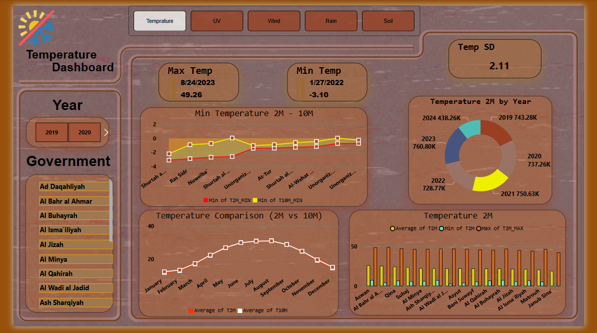
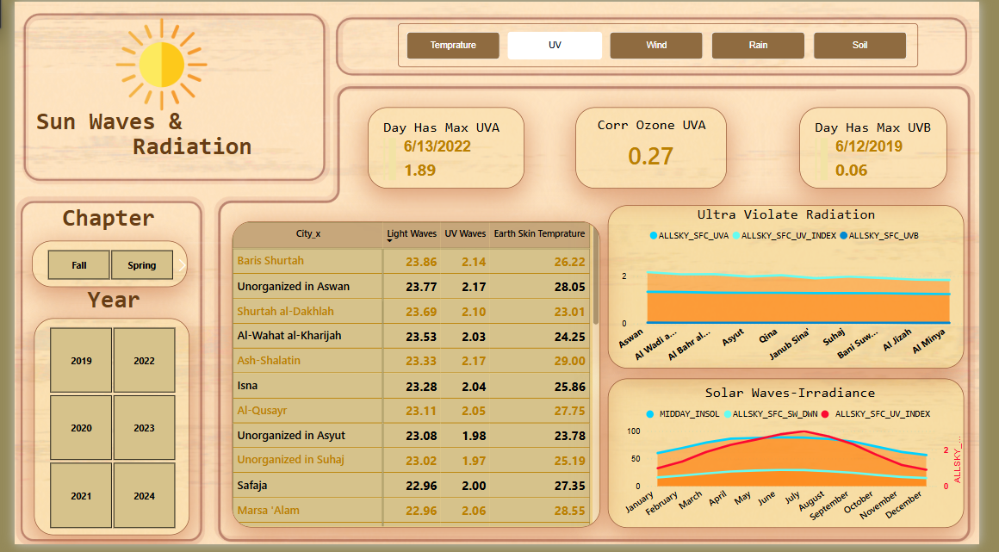
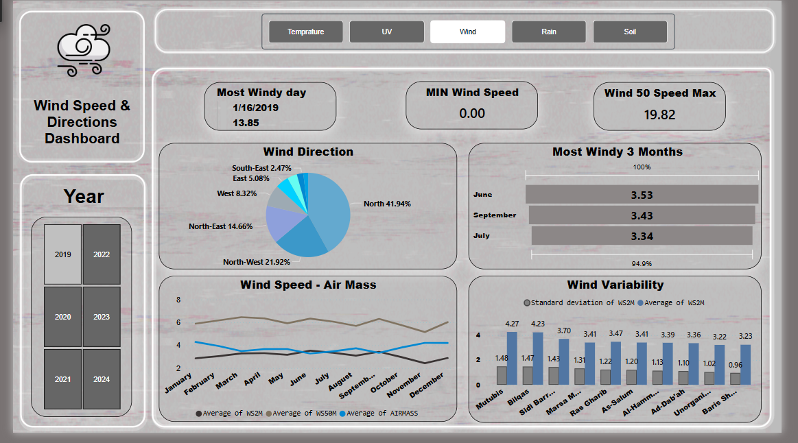
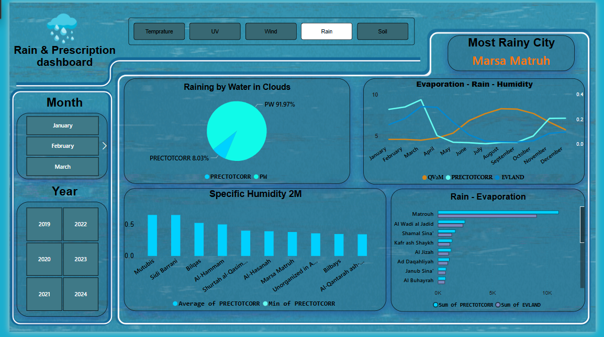
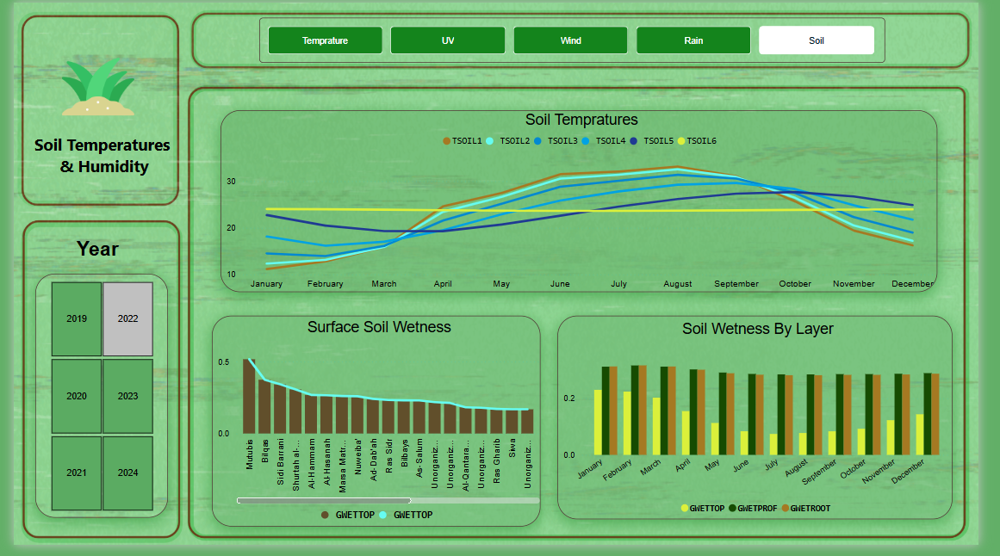
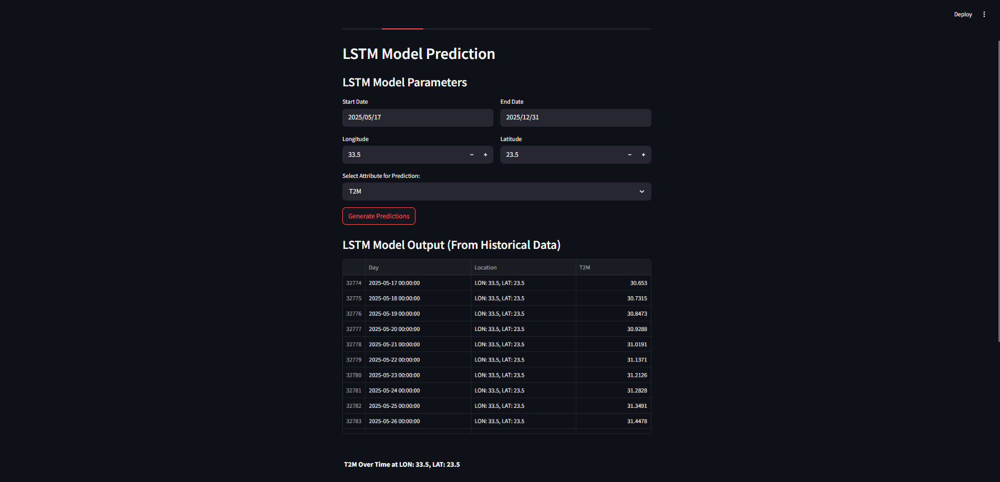
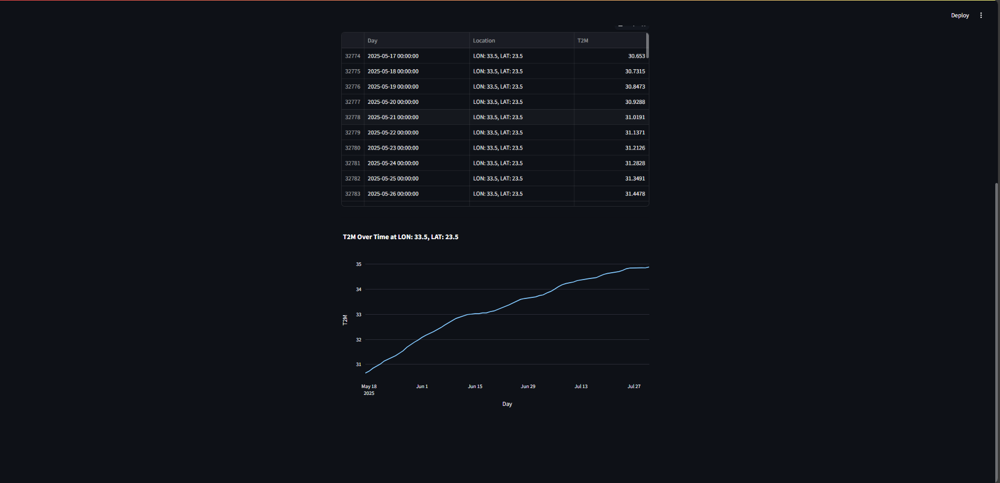
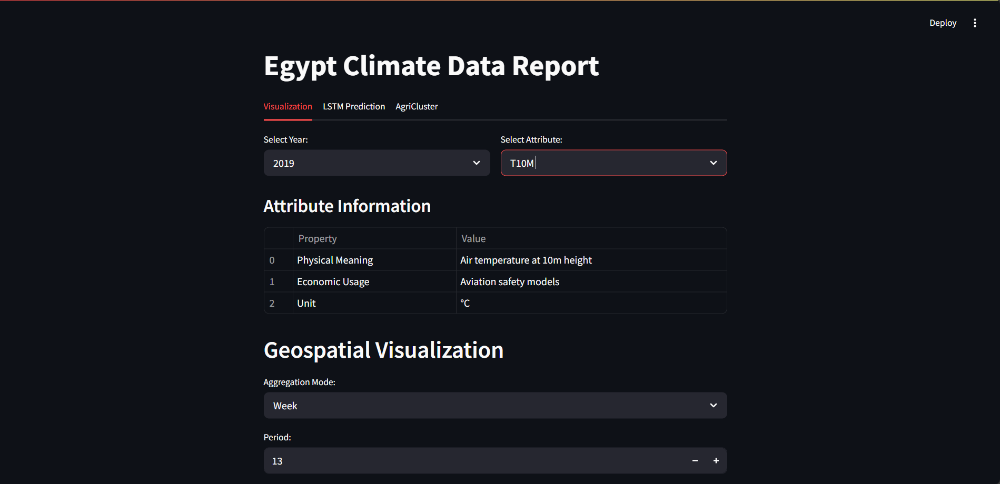

# 🌍 Climate Change Project

## 📋 Table of Contents
- [Introduction](#-introduction)
- [Data Overview](#-data-overview)
- [Problem Statement](#-problem-statement)
- [Objectives](#-objectives)
- [Alignment with Egypt Vision 2030](#-alignment-with-egypt-vision-2030)
- [Project Steps](#-project-steps)
- [Project Structure](#-project-structure)
- [Tech Stack](#-tech-stack)
- [Getting Started](#-getting-started)
- [Useful Links](#-useful-links)
- [Limitations and Future Work](#-Limitations-and-Future-Work)
- [Team](#-team)
- [Acknowledgments](#-acknowledgments)
- [License](#-license)

## 💡 Introduction

Egypt has a unique and diverse climate — from rich soil types to varying temperatures and high solar radiation. This natural diversity opens doors to incredible opportunities in *agriculture, **renewable energy, and **sustainable development*.

However, unlocking this potential starts with one key factor: *understanding our climate accurately and in-depth*. That's where our project comes in — transforming climate data into actionable insights.

Figure 1: Main Dashboard Overview

---

## 📊 Data Overview

### Climate Data Features
Our dataset includes 48 climate features from NASA POWER API, covering:

#### Temperature Data
* Surface temperature (T2M)
* Maximum/minimum temperatures
* Soil temperatures at different depths

#### Solar Radiation
* Surface solar radiation
* UV index
* Cloud amount

#### Wind Data
* Wind speed at different heights
* Wind direction
* Wind gusts

#### Precipitation
* Total precipitation
* Snow precipitation
* Relative humidity

#### Soil Data
* Soil moisture at different depths
* Soil temperature profiles
* Land surface temperature

### Data Coverage
* *Time Period*: 5 years of historical data
* *Geographic Coverage*: All of Egypt
* *Spatial Resolution*: 0.5° x 0.5° grid
* *Temporal Resolution*: Daily measurements

### Data Sources
* *Primary Source*: NASA POWER API
* *Supplementary Data*:
  * Elevation data from Open Elevation API
  * Geographic features from Natural Earth
  * Water bodies from OpenStreetMap
  * Agricultural data from FAO

---

## 📌 Problem Statement

Despite the richness of Egypt's environment, the lack of accurate, up-to-date, and connected climate data leads to *poor decision-making*, particularly in agriculture.

Many Egyptian farmers still rely on outdated information or personal intuition. They often lack tools to:

* Track and understand weather changes
* Analyze how climate affects soil quality
* Choose the best crops for each season

This gap in accessible climate intelligence also limits *renewable energy planning* and *sustainable building design*.

---

## 🎯 Objectives

Our project aims to:

* Decode Egypt's climate using real data and advanced analytics
* Empower farmers with smart agricultural insights
* Help identify optimal regions for solar and wind energy
* Support sustainable urban planning decisions
* Align with *Egypt Vision 2030* in food security, clean energy, and sustainable land use

---

## 🧭 Alignment with Egypt Vision 2030

### ✅ Environmental Pillar
Supports sustainable use of Egypt's natural resources in agriculture and energy.

### ✅ Economic Pillar
Boosts agricultural productivity, reduces waste, and promotes renewable energy investment.

### ✅ Urban Development Pillar
Enables smart, climate-adaptive building and city planning through accurate weather-based insights.

---

## 📊 Project Steps

### 1️⃣ Collecting and Cleaning Climate Data
We gathered climate data from trusted sources, covering:
* Wind
* Rainfall
* Temperature
* Soil types
* Solar radiation

All datasets were cleaned and pre-processed for accurate analysis.

### 2️⃣ Creating 5 Interactive Dashboards
Each dashboard visualizes a different climate factor across time and space:

Figure 2: Temperature Analysis Dashboard

Figure 3: Solar Radiation Analysis Dashboard

Figure 4: Wind Analysis Dashboard

Figure 5: Rainfall Analysis Dashboard

These dashboards offer insights into how each factor behaves *seasonally* and *geographically*.

### 3️⃣ Predictive and Analytical Models 🤖

#### Climate Forecast Model
Uses *LSTM* to predict future climate conditions and support future planning.

Figure 6: LSTM Model Interface

Figure 7: LSTM Model Predictions

#### Geographic Clustering Model
Uses *K-Means* to group areas with similar climate traits, providing:
* Best planting seasons
* Suggested crops for each area

Figure 8: Agricultural Clusters Overview

Figure 9: Detailed Agricultural Clusters

---

## 📁 Project Structure

DEPI_DATA/
├── data
├── notebooks/            # Jupyter notebooks for analysis
│   ├── EDA/             # Exploratory data analysis
│   ├── Models/          # Model development notebooks
│   └── Visualization/   # Visualization notebooks
├── src/                  # Source code
│   ├── models/          # ML models
│   │   ├── lstm/        # LSTM model implementation
│   │   └── clustering/  # K-means clustering
│   └── visualization/   # Visualization code
├── StreamlitPage/       # Streamlit application
│    └──application.py   # Main Streamlit app
├── requirements.txt     # Project dependencies
└── README.md           # Project documentation

---

## 🧠 Tech Stack

### 📡 Data Sources
*  – 48 climate features (5 years)
*  – Elevation data
*  – Coastline distances
*  – Nile River data
*  – Land cover and crop suitability

### 📊 Data Analysis & Modeling
*  (Pandas, NumPy, ydata-profiling) – EDA and data cleaning
*  – Map visualizations
*  – Interactive web interface
*  – Time series forecasting
*  – Geographical clustering
*  – Temporal and spatial features

### 📈 Visualization
*  – Interactive dashboards
*  – Final visualization layer

---

## 🚀 Getting Started

### Installation
bash
pip install streamlit

### Running the Application
1. Navigate to the project directory:
bash
cd DEPI_DATA

2. Run the Streamlit app:
bash
streamlit run app.py

### Key Features
* *Interactive Maps*: Visualize climate data across Egypt
* *Time Series Analysis*: Track climate changes over time
* *Predictive Models*: View forecasts and predictions
* *Data Export*: Download processed data and visualizations

Figure 10: Streamlit Application Overview

Figure 11: Interactive Map Features

Figure 12: Data Analysis Features

---

## 🔗 Useful Links
* [NASA POWER API Documentation](https://power.larc.nasa.gov/docs/)
* [Open Elevation API](https://open-elevation.com/)
* [Natural Earth Data](https://www.naturalearthdata.com/)
* [OpenStreetMap](https://www.openstreetmap.org/)
* [FAO Data](http://www.fao.org/faostat/en/#data)
* [Streamlit Documentation](https://docs.streamlit.io/)
* [Egypt Vision 2030](https://sdsegypt2030.com/)

---
## 🚧 Limitations and Future Work
*Limitations:*
Simplified Assumptions in Clustering: The clustering model is based solely on climatic features; it doesn’t yet include socio-economic or infrastructure data that may affect implementation.
Limited Vegetation Recommendations: The plant suggestions are based on basic climate compatibility and don’t yet account for market demand, soil nutrients, or water availability.

*Future Work:*
Incorporate Socio-economic Data: Combine environmental insights with socio-economic indicators to support more realistic planning (e.g., cost, labor availability).
Mobile Dashboard: Create a mobile-friendly version of the dashboard for use by farmers and field engineers.

## 👥 Team
This project was developed by a team of data analysis trainees as part of the final capstone project for the *Digital Egypt Pioneers Initiative*. The team members are:

* *Ahmed Ashraf Labib*
* *Abdullah Saleh Mahmoud*
* *Mariam Ehab Mostafa*
* *Mohamed Ragab Attia*
* *Sara Ahmed Omar Ali*
* *Mohamed Sameh Abozaid*

---

## 🙏 Acknowledgments
This project was delivered as the *final graduation project* for the *Digital Egypt Pioneers Initiative* — an initiative by the *Ministry of Communications and Information Technology (MCIT)* in Egypt.

Special thanks to:
* *CLS (Creative Learning Solutions)* – Our training partner who supervised our learning journey and project development.
* *Dr. Alaa Abdel-Moaty* – Our lead instructor, whose guidance and support were fundamental to our success.

---

## 📝 License
This project is licensed under the MIT License - see the [LICENSE](LICENSE) file for details.
